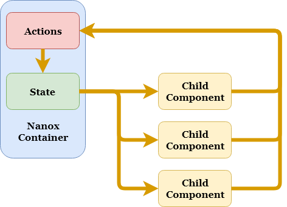
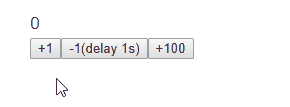

English | [日本語](README_ja.md)

# Nanox

Nanox is a minimal framework for small projects using React.

It is intended to be used when you want to create a React application using some framework but you do not need to be as big as Redux.

The feeling of use is close to Hyperapp(v1).



* [Feature](#feature)
* [Install](#install)
* [Usage](#usage)
* [Examples](#examples)
* [Spec of Action](#spec-of-action)
* [Advanced Usage](#advanced-usage)
* [License](#license)

## Feature

* Low learning costs
* Provides multiple state update methods depending on the purpose
* Because views and actions are separated, it's easy to test each one alone.

## Install

```sh
$ npm install nanox
```

## Usage

### STEP 1 - Create actions

First, create actions to use in child components.

```js
const myActions = {
  // action name is 'increment'
  increment(count) {
    // return partial state that you want to update
    return {
      count: this.state.count + count
    };
  },

  // action name is 'decrement'
  decrement(count) {
    // you can return Promise Object that resolve partial state
    return new Promise((resolve, reject) => {
      setTimeout(() => {
        // resolve partial state that you want to update
        resolve({
          count: this.state.count - count
        });
      }, 1000);
    });
  }
};

export default myActions;
```

### STEP 2 - Create child component

Create child component that uses the actions created in STEP1.

In the following example, the actions are received via `props`, but you may use `Context` instead.

```js
const CounterComponent = ({ actions, count }) => {
  // execute action in click handler
  return (
    <div>
      <div>{count}</div>
      <button onClick={() => actions.increment(1)}>+1</button>
      <button onClick={() => actions.decrement(1)}>-1(delay 1s)</button>
      <button onClick={() => actions.increment(100)}>+100</button>
    </div>
  );
};

export default CounterComponent;
```

### STEP 3 - Create Nanox container

Create Naxox container to manage actions and child components.

```js
// import React
import React from 'react';
import ReactDOM from 'react-dom';

// import Nanox
import Nanox from 'nanox';

// import actions created in STEP 1
import myActions from './actions';

// import child component created in STEP 2
import CounterComponent from './counter';

// create container (inherit Nanox)
class MainContainer extends Nanox {
  constructor(props) {
    super(props);
    this.state = { count: 0 };
  }

  render() {
    // pass this.actions to child component props (not this.props.actions)
    return <CounterComponent actions={this.actions} count{...this.state} />;
  }
}
```

### STEP 4 - Mount the Nanox container

Mount the Nanox container created in STEP 3 to the DOM.

At this time, register the actions created in STEP 1 via props.

```js
ReactDOM.render(
  // register actions that created at STEP 1
  <MainContainer actions={myActions} />,
  document.getElementById('app')
);
```

## Examples



* [Example file of this repository](example.html)

## Spec of Action

### If Action returns values, that must be partial state object or Promise Object.

#### :x: __Bad__: return number

```js
const myActions = {
  foo(x, y, z) {
    return x + y + z;
  }
};
```

#### :heavy_check_mark: __Good__: return partial state

```js
const myActions = {
  foo(x, y, z) {
    return {
      count: x + y + z
    };
  }
};
```

#### :heavy_check_mark: __Good__: return Promise Object (resolve partial state)

```js
const myActions = {
  foo(x, y, z) {
    return new Promise((resolve, reject) => {
      resolve({
        count: x + y + z
      });
    });
  }
};
```

#### :heavy_check_mark: __Good__: return nothing (no effect on Nanox container)

```js
const myActions = {
  foo(x, y, z) {
    console.log(x, y, z);
  }
}
```

### Get the current state in actions

You can get the current state in Nanox container from `this.state` in the action.

```js
class MainContainer extends Nanox {
  constructor (props) {
    super (props);
    // create state in Nanox container
    this.state = {
      count: 0,
      waiting: false
    };
  }
    .
    .
    .
}
```

```js
const myActions = {
  increment (count) {
    // get the current state in the action
    const currentState = this.state; // => {
                                     //  count: 0,
                                     //  waiting: false
                                     //}
      .
      .
      .
  }
};
```

##### Note

Since `this.state` is a copy of the latest state of the Nanox container, changing this value directly has no effect on the state of the Nanox container.

## Advanced Usage

### Updating state by `this.query()`

You can also update the state by MongoDB-like query using `this.query()`.

```js
class MainContainer extends Nanox {
  constructor(props) {
    super(props);
    this.state = {
      // create state in Nanox container
      fruits: [ 'apple', 'banana', 'cherry' ]
    };
  },
    .
    .
    .
};
```

```js
const myActions = {
  addLemon() {
    // call this.query() with $push command, and return functions result
    return this.query({
      fruits: {
        $push: [ 'lemon' ] // => will be [ 'apple', 'banana', 'cherry', 'lemon' ]
      }
    });
  },
    .
    .
    .
};
```
The available commands are [here](https://github.com/kolodny/immutability-helper#available-commands).

In addition to the above commands, you can also add custom commands.

```js
ReactDOM.render(
  // register $increment command when mounting Nanox container
  <MainContainer
    actions={myActions}
    commands={{
      $increment: (value, target) => target + value
    }}
  />,
  document.getElementById('app')
);
```

```js
const myActions = {
  increment() {
    // can use $increment command in action
    return this.query({
      // value = 1, target = this.state.count
      count: { $increment: 1 }
    });
  },
    .
    .
    .
};
```

See [here](https://github.com/kolodny/immutability-helper#adding-your-own-commands) for details on how to create custom commands.

##### Note

Direct specification of state value can not be mixed in `this.query()`.

```js
// Bad
return this.query({
  name: 'foo',
  history: { $push: [ 'change name' ] }
});
```

If you want to execute the direct specification of status value and query command simultaneously as above, use `$set` command instead of direct specification of status value.

```js
// Good
return this.query({
  name: { $set: 'foo' },
  history: { $push: [ 'change name' ] }
});
```

### Action chaining

Calling an action in child components returns a Promise object that resolves when the action is completed, so you can perform multiple actions in sequence.

It is used, for example, to display the indicator when performing long actions in sequence and to clear the indicator when it is completed.

And you can also catch errors that occur in actions using `catch`.

```js
return (
  <button onClick={
    actions.loading(true)
    .then(() => actions.fetchFriends())
    .then(() => actions.sendMessage('hello'))
    .then(() => actions.loading(false))
    .catch(console.error);
  }>Say hello to my friends</button>
);
```

### Pre-update hook

You can register a hook method(`onSetState()`) that will be executed just before the state is updated by the action.

If `onSetState()` process returns `false`, this state updating is aborted.

```js
class MainContainer extends Nanox {
    .
    .
    .
  onSetState(data, type) {
    // data = partial state or update query that will apply to Nanox state
    // type = 'state' or 'query'
    if ( ... ) {
      // You can block applying action result to state by returning false at onSetState()
      return false;
    }
  }
    .
    .
    .
};
```

##### Note

Since the data that is the argument of `onSetState()` is a copy of the state part to be updated, changing this value directly will not change the updated contents.

### How to use from TypeScript

see [here](__tests__/check.tsx).

## License

[MIT](http://www.opensource.org/licenses/mit-license)

&copy; 2017-2019 [ktty1220](mailto:ktty1220@gmail.com)
