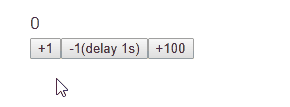

[English](README.md) | 日本語

# Nanox

NanoxはReactを使用した小規模プロジェクト用のフレームワークです。

素のReactだと物足りないがReduxのような規模は必要ないケースでの使用を想定しています。

使用感としてはHyperapp(v1)に近い感じに仕上がっています。


* [特徴](#%E7%89%B9%E5%BE%B4)
* [インストール](#%E3%82%A4%E3%83%B3%E3%82%B9%E3%83%88%E3%83%BC%E3%83%AB)
* [使用方法](#%E4%BD%BF%E7%94%A8%E6%96%B9%E6%B3%95)
* [サンプル](#%E3%82%B5%E3%83%B3%E3%83%97%E3%83%AB)
* [アクションの仕様](#%E3%82%A2%E3%82%AF%E3%82%B7%E3%83%A7%E3%83%B3%E3%81%AE%E4%BB%95%E6%A7%98)
* [高度な使用方法](#%E9%AB%98%E5%BA%A6%E3%81%AA%E4%BD%BF%E7%94%A8%E6%96%B9%E6%B3%95)
* [ライセンス](#%E3%83%A9%E3%82%A4%E3%82%BB%E3%83%B3%E3%82%B9)

## 特徴

* 低い学習コスト
* 目的に応じた複数のstate更新方法を提供
* ビューとアクションを分離するのでビュー単体、アクション単体でのテストがしやすい

## インストール

```sh
$ npm install nanox
```

## 使用方法

### STEP 1 - アクションの作成

まず、ビュー内で使用するアクションを作成します。

```js
const myActions = {
  // incrementというアクション名
  increment(count) {
    // state内の更新したい部分だけを返す
    return {
      count: this.state.count + count
    };
  },

  // decrementというアクション名
  decrement(count) {
    // 非同期処理の場合はPromiseを返す
    return new Promise((resolve, reject) => {
      setTimeout(() => {
        // resolveでstate内の更新したい部分だけを指定する
        resolve({
          count: this.state.count - count
        });
      }, 1000);
    });
  }
};

export default myActions;
```

### STEP 2 - 子コンポーネントを作成

STEP 1で作成したアクションを受け取ってビュー内で使用する子コンポーネントを作成します。

以下の例ではprops経由でアクションを受け取っていますが、Contextを使用する形でも問題ありません。

```js
const CounterComponent = ({ actions, count }) => {
  // クリックハンドラでアクションを実行
  return (
    <div>
      <div>{count}</div>
      <button onClick={() => actions.increment(1)}>+1</button>
      <button onClick={() => actions.decrement(1)}>-1(delay 1s)</button>
      <button onClick={() => actions.increment(100)}>+100</button>
    </div>
  );
};

export default CounterComponent;
```

### STEP 3 - Nanoxコンテナを作成

アクションや子コンポーネントを管理するNaxoxコンテナを作成します。

```js
// Reactをインポート
import React from 'react';
import ReactDOM from 'react-dom';

// Nanoxをインポート
import Nanox from 'nanox';

// STEP 1で作成したアクションリストをインポート
import myActions from './actions';

// STEP 2で作成した子コンポーネントをインポート
import CounterComponent from './counter';

// Nanoxを継承したReactコンテナを作成
class MainContainer extends Nanox {
  constructor(props) {
    super(props);
    this.state = { count: 0 };
  }

  render() {
    // 子コンポーネントの呼び出し時にthis.actionsをpropsに渡す
    return <CounterComponent actions={this.actions} count{...this.state} />;
  }
}
```

### STEP 4 - Nanoxコンテナのマウント

STEP 3で作成したNanoxコンテナをDOMにマウントします。

この時にSTEP 1で作成したアクションをprops経由で登録します。

```js
ReactDOM.render(
  // STEP 1で作成したアクションリストをNanoxコンテナに登録
  <MainContainer actions={myActions} />,
  document.getElementById('app')
);
```

## サンプル



* [このリポジトリのexample.html](example.html)

## アクションの仕様

### アクションではstateの一部かそれをresolveするPromiseオブジェクトを返すようにする

#### :x: __Bad__: 数値を返す

```js
const myActions = {
  foo(x, y, z) {
    return x + y + z;
  }
};
```

#### :heavy_check_mark: __Good__: stateの一部を返す

```js
const myActions = {
  foo(x, y, z) {
    return {
      count: x + y + z
    };
  }
};
```

#### :heavy_check_mark: __Good__: Promiseオブジェクトを返す(stateの一部をresolveする)

```js
const myActions = {
  foo(x, y, z) {
    return new Promise((resolve, reject) => {
      resolve({
        count: x + y + z
      });
    });
  }
};
```

#### :heavy_check_mark: __Good__: 何も返さない(stateには何の影響もありません)

```js
const myActions = {
  foo(x, y, z) {
    console.log(x, y, z);
  }
}
```

### アクション内で現在のstateを参照する方法

アクション内では`this.state`で最新のstateを取得できます。

```js
class MainContainer extends Nanox {
  constructor(props) {
    super(props);
    // Nanoxコンテナでstateを作成
    this.state = {
      count: 0,
      waiting: false
    };
  }
    .
    .
    .
}
```

```js
const myActions = {
  increment(count) {
    // アクション内で現在のstateを取得する
    const currentState = this.state; // => {
                                     //    count: 0,
                                     //    waiting: false
                                     // }
      .
      .
      .
  }
};
```

##### 補足

`this.state`はNanoxコンテナの最新stateのコピーなので、この値を直接変更してもNanoxコンテナのstateには何の影響もありません。

## 高度な使用方法

### `this.query()`によるstateの更新

アクション内ではstateの一部を返す方法の他に、`this.query()`を使用することによってMongoDBのようなクエリでstateを更新することもできます。

```js
class MainContainer extends Nanox {
  constructor(props) {
    super(props);
    // Nanoxコンテナでstateを作成
    this.state = {
      fruits: [ 'apple', 'banana', 'cherry' ]
    };
  },
    .
    .
    .
};
```

```js
const myActions = {
  addLemon() {
    // アクション内で$pushコマンドによる配列の値の追加をthis.query()で指定してその戻り値を返す
    return this.query({
      fruits: {
        $push: [ 'lemon' ] // => stateは[ 'apple', 'banana', 'cherry', 'lemon' ]になる
      }
    });
  },
    .
    .
    .
};
```

使用できるコマンドは[こちら](https://github.com/kolodny/immutability-helper#available-commands)になります。

また、上記コマンドの他にもユーザー定義のコマンドを登録する事もできます。

```js
ReactDOM.render(
  // Nanoxコンテナのマウント時にcommands propsに$incrementコマンドを登録する
  <MainContainer
    actions={myActions}
    commands={{
      $increment: (value, target) => target + value
    }}
  />,
  document.getElementById('app')
);
```

```js
const myActions = {
  increment() {
    // アクション内で$incrementコマンドを使用可能
    return this.query({
      // value = 1, target = this.state.count
      count: { $increment: 1 }
    });
  },
    .
    .
    .
};
```

ユーザー定義コマンドの作成方法の詳細は[こちら](https://github.com/kolodny/immutability-helper#adding-your-own-commands)を参照してください。

#### 補足

`this.query()`の中で通常のstate値直接指定を混在させることはできません。

```js
// Bad
return this.query({
  name: 'foo',
  history: {
    $push: [ 'change name' ]
  }
});
```

上記のように、state値直接指定と更新コマンドを同時に行いたい場合は、state値直接指定の部分を$setコマンドにします。

```js
// Good
return this.query({
  name: { $set: 'foo' },
  history: {
    $push: [ 'change name' ]
  }
});
```

### アクションチェーン

ビュー内でアクションを呼び出すとPromiseオブジェクトを返すので、複数のアクションを順番に実行することができます。

何か長い処理を行う場合にまずローディングインジケータを表示して、それらが完了したらインジケーターを消去するといったケースに使用します。

また、アクション内で発生したエラーを`catch`で補足できます。

```js
return (
  <button onClick={
    actions.loading(true)
    .then(() => actions.fetchFriends())
    .then(() => actions.sendMessage('hello'))
    .then(() => actions.loading(false))
    .catch(console.error);
  }>Say hello to my friends</button>
);
```

### state更新前フック

アクションよってstateが更新される直前に実行されるフック処理をNanoxコンテナに登録する事ができます(`onSetState()`メソッド)。

このフック処理で`false`を返すとそのstate更新は中止されます。

```js
class MainContainer extends Nanox {
    .
    .
    .
  onSetState(data, type) {
    // data = 更新されようとしているstate部分もしくは更新コマンド
    // type = 'state'もしくは'query'
    if ( ... ) {
      // falseを返すとこのstate更新はブロックされる
      return false;
    }
  }
    .
    .
    .
};
```

`onSetState()`の引数である`data`は更新されようとしているstate部分のコピーなので、この値を直接変更しても更新内容が変わることはありません。

### TypeScriptでの使用方法

[こちら](__tests__/check.tsx)を参考にしてください。

## ライセンス

[MIT](http://www.opensource.org/licenses/mit-license)

&copy; 2019 [ktty1220](mailto:ktty1220@gmail.com)
